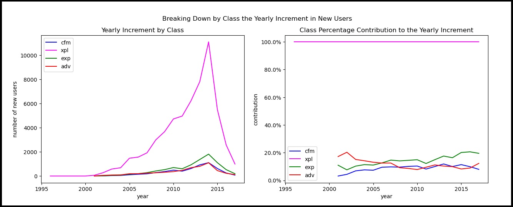



# [BeerAdvocate](https://www.beeradvocate.com/), what kind of raters does the website attract?
## Motivation
## Goal
## Research questions
## Data
We use the dataset provided by BeerAdvocate at this [link](https://drive.google.com/drive/folders/1Wz6D2FM25ydFw_-41I9uTwG9uNsN4TCF).
## The data analysis

### The categories

#### **Conformist:** 
A user which rates closely to the average rating of the beers.

  
Show more details

  
  A user   $u$  is a conformist if he/she has a high conformism score defined as follows:
  $$CFM_u = \frac{1}{|B_u|}\sum_{b \in B_u}(\frac{r_{u,b}-\overline{r_b}}{\sigma_b})^2$$
  where $B_u$ is the set of beers the user $u$ has rated, $r_{u,b}$ is the rating given by user $u$ to beer $b$, $\sigma_b$ is the standard deviation of the ratings of the beer $b$, and $\overline{r_b}$ is the average rating of beer $b$. 
  The metric is high if the user, on average, rates beers close to the average rating they get. This metric, aside from classifying users, could be an indicator of hearding effect if users from a particular region (a US state) have a high conformism score on average.

 

#### **Expert-like:** 
A user which rates closely to the reference expert rating.

  
Show more details

  A user $u$ is an expert-like if he/she has a high score similarity with our reference for expert rating. The score is defined as follows:
  $$EXP_u = \frac{1}{\frac{1}{|B_u|}\sum_{b \in B_u}(\frac{r_{u,b}-ref_b}{\sigma_b})^2}$$
  where $r_{u,b}$ is the rating given by user $u$ to beer $b$, $\sigma_b$ is the standard deviation of the ratings of the beer $b$, and $ref_b$ is a reference of objective rating of a beer $b$. The reference can be either the bros score in the range $[0,5]$, or the BA score scaled down to the range $[0,5]$ (originally in $[0, 100]$). Since the BA score is more abundant (94.5% of beers rated have a BA score), we may be using it as a reference. Both scores are objective ratings provided by administrators of beeradvocate.com who we assume adhere to the guidelines of objective beer reviewing. 
  The score is large if, on average, the user rates beers close to the reference score. This metric is our best shot at detecting senior beer raters and experts active on the website based solely on the available data.

 

#### **Explorator:**
A user which rates beers that have only a few ratings.

  
Show more details

  
  A user $u$ is an explorator if he/she has a high adventurer score defined as follows where $U_{10}(b)$ is the set of at most 10 users that first rated the beer $b$:
  $$XPL_u = \sum_{b \in B_u} \mathbb{1} [u \in U_{10}(b)]$$
  This metric is larger for users that try out new beers that have not been in the spotlight (that is why they are explorators), and is low for users that almost always rate beers that have been already been rated many times before (in our case 10 times at least). This score provides us with information about which users contribute to enriching the experience on the website, either because they rate beers that do not get much attention, or because they "introduce" new beers on the website by being the first people to rate those beers.

 

#### **Adventurer:**
A user which rates a certain amount a poorly rated beers.

  
Show more details

  
  A user 
  $u$ is an adventurer if he/she often rates a beer $b$  that has a low score at time $t_{u,b}$ at which he/she rates it, measured as follows where $T$ is a threshold to be determined empirically (see next section):
  $$ADV_u = \sum_{b \in B_u} \mathbb{1} [r_b(t_{u,b}) < T]$$
  This metric is higher for users that try out beers that have a bad rating. We want to know if the users frequenting the website are generally reluctant or willing to try out beers with bad ratings.

 

### Time analysis

{width=50%}
_Fig?: This plot shows..._

_Fig?: This plot shows..._

_Fig?: This plot shows..._

### Likelihood & ratings/reviews analysis


_Fig?: This plot shows..._

_Fig?: This plot shows..._

_Fig1: This plot shows..._

    
    _Fig?: This plot shows..._
    

        
    _Fig?: This plot shows..._
    

        
    _Fig?: This plot shows..._
   

        
    _Fig?: This plot shows..._
   

