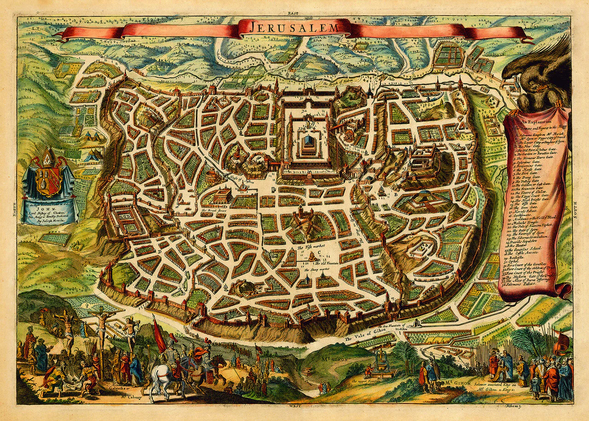

## <a id="section_intro">Introduction</a>
We're to spatialze the travelogue around Jerusalem.

## <a id="section_overview">Overview</a>

Here is a list of all the toponyms, classified by chapters.



First, let's take a look at Sarah's movements in Jerusalem.



Then if we focus on those she really visited:



What about visualizing these on real maps?

## <a id="section_1">Chapter 1</a>
This is Chapter 1.



## <a id="section_2">Chapter 2</a>
This is Chapter 2.



## <a id="section_3">Chapter 3</a>
This is Chapter 3.



## <a id="section_4">Chapter 4</a>
This is Chapter 4.



## <a id="section_5">Chapter 5</a>
This is Chapter 5.



## <a id="section_6">Chapter 6</a>
This is Chapter 6.



## <a id="section_7">Chapter 7</a>
This is Chapter 7.



## <a id="section_8">Chapter 8</a>
This is Chapter 8.



## <a id="section_9">Chapter 9</a>
This is Chapter 9.



## <a id="section_10">Chapter 10</a>
This is Chapter 10.



## <a id="section_11">Chapter 11</a>
This is Chapter 11.



## <a id="section_12">Chapter 12</a>
This is Chapter 12.



## <a id="section_13">Chapter 13</a>
This is Chapter 13.



## <a id="section_14">Chapter 14</a>
This is Chapter 14.



## <a id="section_16">Chapter 16</a>
This is Chapter 16.



## <a id="section_18">Chapter 18</a>
This is Chapter 18.



## <a id="section_19">Chapter 19</a>
This is Chapter 19.



## <a id="section_20">Chapter 20</a>
This is Chapter 20.



